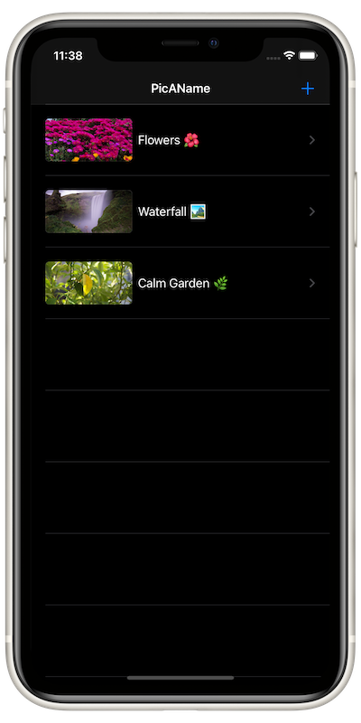
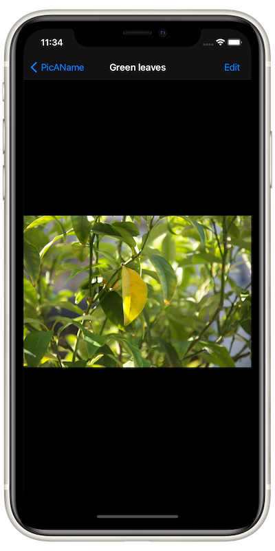
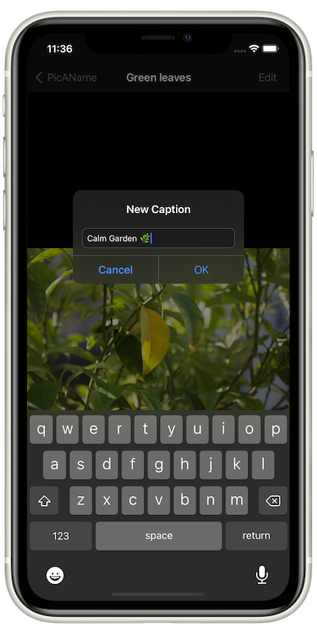

# PicAName App
## About
PicAName is an app that lets you pick or capture photos and display them in a table view.

Users can also add a caption to each photo and edit the caption later as they wish.

## Concepts Utilized
* MVC-oriented (Model-View-Controller) architecture
* UserDefaults
* Storyboard/AutoLayout

## Screenshots

## Acknowledgement
PicAname is coded in correspondence to Paul Hudson’s "100 Days Of Swift" challenge, [day 50](https://www.hackingwithswift.com/100/50).