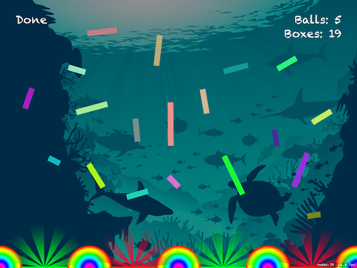

# Project 11: Panchiko

## ℹ️ About

Project 11 is a game project inspired by the Panchiko game, which belongs to Paul Hudson’s “100 Days of Swift” course from day 45 to 47.

🔗 Original link : [Project 11](https://www.hackingwithswift.com/100/45)

## 📸 Screenshots:

