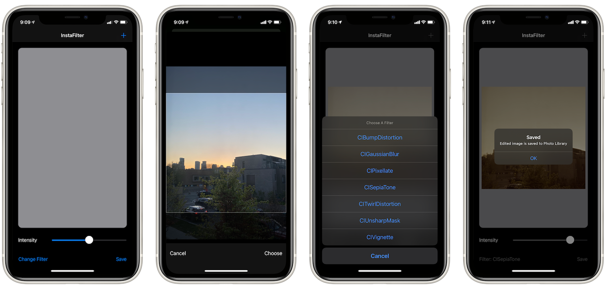

# InstaFilter
## About
InstaFilter is an app that lets you pick and apply a filter to your photo, then save it back to Photo Library.

## Concepts Utilized
* `CoreImage`
* `Storyboard`/`AutoLayout`
* `Code Encapsulation`

## Screenshots

## Acknowledgement
InstaFilter is coded in correspondence to Paul Hudson’s "100 Days Of Swift" challenge, starting from [day 52](https://www.hackingwithswift.com/100/52) to [day 54](https://www.hackingwithswift.com/100/54).
