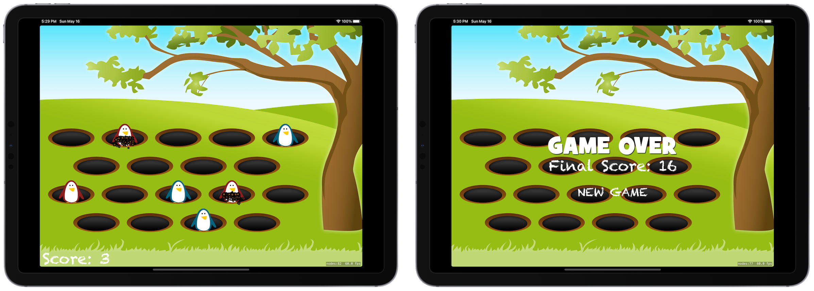

# Whack-a-penguin
## About
Whack-a-penguin is a game that mimics your childhood fav "Whack-a-mole", letting you whack a penguin emerging from a ground hole 🐧🕹.

Game best played with sound on 🔊

## Concepts Utilized
* `SpriteKit`
* `Subclasses of SKNode`
* `Code Encapsulation`

## Screenshots

## Acknowledgement
Whack-a-penguin is coded in correspondence to Paul Hudson’s "100 Days Of Swift" challenge, starting from [day 55](https://www.hackingwithswift.com/100/55) to [day 56](https://www.hackingwithswift.com/100/56).
