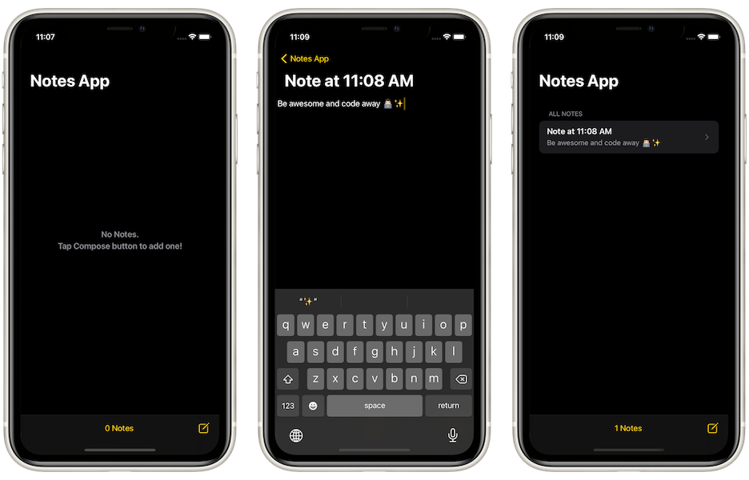

# NANA (Not Another Notes App)
## About
NANA is a notes app that imitates Apple’s stock Notes App with basic functionalities: adding, sharing, and deleting notes.

## Concepts Utilized
* `Model-View-VController` architecture
* 100% Programmatical `AutoLayout`
* Persistence with `UserDefaults`
* `ResultType`
* Dynamically-sized `UITextView` with keyboard observers
* `Delegate` protocols

## Screenshots

## Acknowledgement
NANA is coded from scratch as a milestone project in correspondence to Paul Hudson’s "100 Days Of Swift" challenge, [day 74](https://www.hackingwithswift.com/100/74).