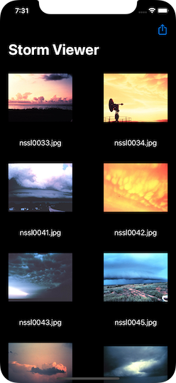
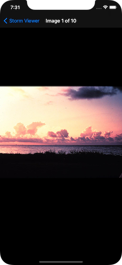

# Project 1 (Modded, Day 44): Storm Viewer 🌪

## ℹ️ About

Project 1 Modded for Day 44 is one of the 3 challenges to attempt on Day 44 of Paul Hudson’s “100 Days of Swift” course. It is a modified version of the original Project 1 from day 16 - 18.

> Modify project 1 so that it uses a collection view controller rather than a table view controller. I recommend you keep a copy of your original table view controller code so you can refer back to it later on.

🔗 Original link : [Project 10 - Wrap Up](https://www.hackingwithswift.com/read/10/7/wrap-up)

## 📸 Screenshots:

