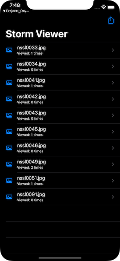
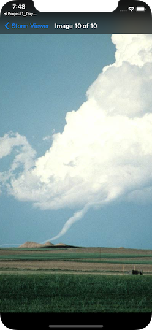

# Project 1 (Modded, Day 49): Storm Viewer 🌪

## ℹ️ About

Project 1 Modded for Day 49 is one of the 3 challenges to attempt on Day 49 of Paul Hudson’s “100 Days of Swift” course. It is a modified version of the original Project 1 from day 16 - 18.

> Modify project 1 so that it remembers how many times each storm image was shown – you don’t need to show it anywhere, but you’re welcome to try modifying your original copy of project 1 to show the view count as a subtitle below each image name in the table view.

🔗 Original link : [Project 12 - Wrap Up](https://www.hackingwithswift.com/read/12/5/wrap-up)

## 📸 Screenshots:

