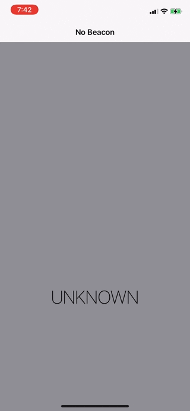

# Detect-a-Beacon
## About
Detect-a-Beacon is an app that, as its name indicates, detects known beacons using Apple’s [iBeacon technology](https://developer.apple.com/ibeacon/) from iOS 7.

## Concepts Utilized
* `Model-ViewVController` architecture
* 100% Programmatical `AutoLayout`
* `Core Location`
* Animations

## Screenshots

## Acknowledgement
Detect-a-Beacon project is coded in correspondence to Paul Hudson’s "100 Days Of Swift" challenge, [day 75](https://www.hackingwithswift.com/100/75) and [day 76](https://www.hackingwithswift.com/100/76).

However, the code structure is drastically different from the original tutorial with 100% programmatical AutoLayout and having my own spin.
