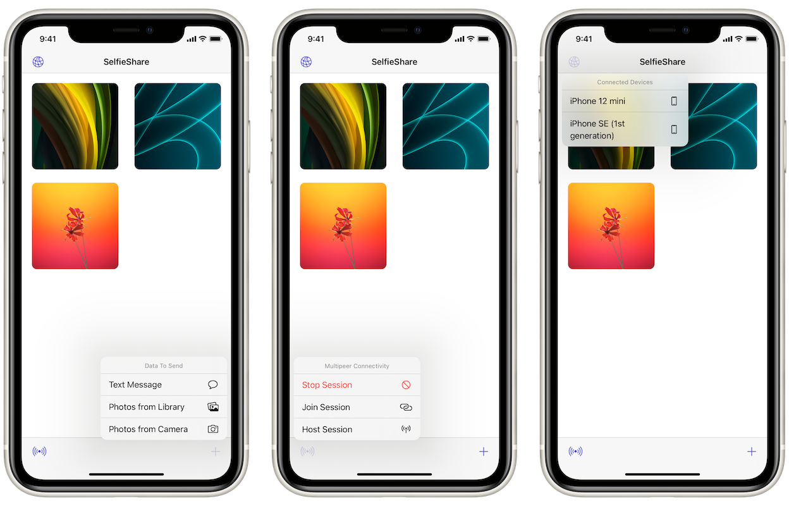

# SelfieShare
## About
SelfieShare is an app that lets you and your peers join a peer-to-peer session to share photos and text messages (imagine a walkie-talkie-style convo 🗣🎙).

## Concepts Utilized
* `Multipeer Connectivity`
* `UICollectionView`
* `UIMenu`
* Programmatic `AutoLayout`
* Functional programming for code readability & reusability

## Screenshots

## Acknowledgement
SelfieShare project is coded in correspondence to Paul Hudson’s "100 Days Of Swift" challenge, [day 83](https://www.hackingwithswift.com/100/83) and [day 84](https://www.hackingwithswift.com/100/84).

Furthermore, the code structure has been drastically refactored to be more readable and reusable, in comparison to the original tutorial.

### NOTE

Incidentally 1 chunk of the tutorial wasn’t introduced in that the app won’t let you connect to an active session if you were following along with the tutorial’s reading. There are several suggested solutions on [the forum](https://www.hackingwithswift.com/forums), in which there’s 1 from me too [here](https://www.hackingwithswift.com/forums/100-days-of-swift/fix-for-project-25-code-not-letting-you-connect-to-another-hosting-peer/9369).

