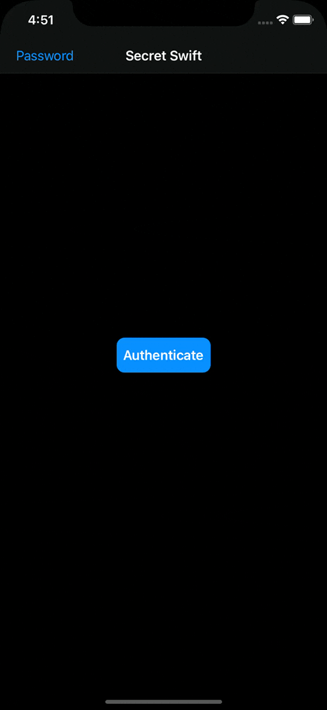

# Secret Swift
## About
Secret Swift is a simple iOS app that lets you enter secret messages and secure them with the device’s biometry mechanism and/or a password.

This app is a tutorial project, coded as per instructions by [Paul Hudson](https://twitter.com/twostraws) from [#100DaysOfSwift](https://www.hackingwithswift.com/100/92) course. However, I modified it quite heavily with my own spins from the start and extended the app functionality with [extra challenges](https://www.hackingwithswift.com/read/28/5/wrap-up).

## Concepts Utilized
* `LocalAuthentication`
* iCloud Keychain
* `View-ViewController` Architecture
* `Code Encapsulation`
* `Programmatic AutoLayout`
* `UIMenu`

## Screenshots

## Acknowledgement
Special thanks to the open source code from [Khumar Girdhar](https://github.com/khumargirdhar).