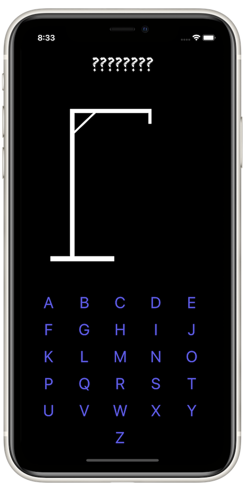
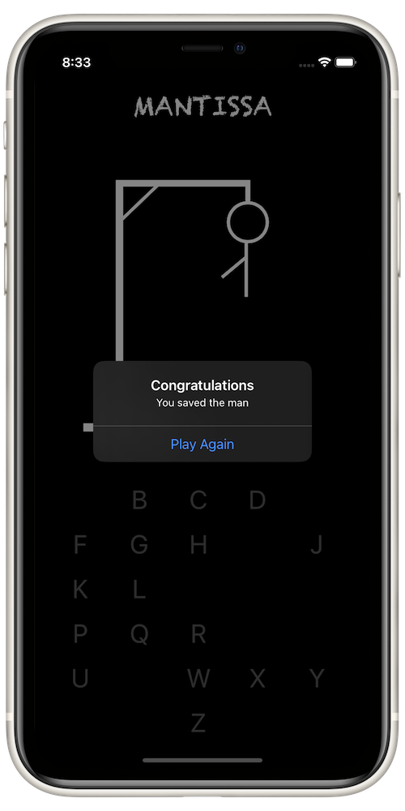

# Hangman

## About
This app is made in correspondence with the challenge prompt from Paul Hudson's "100 Days of Swift" course, day 41. [Link here](https://www.hackingwithswift.com/100/41)

## Concepts
* UIKit
* Programmatic AutoLayout
* UIBezierPath
* CAShapeLayer and sub-layers

## Screenshots

